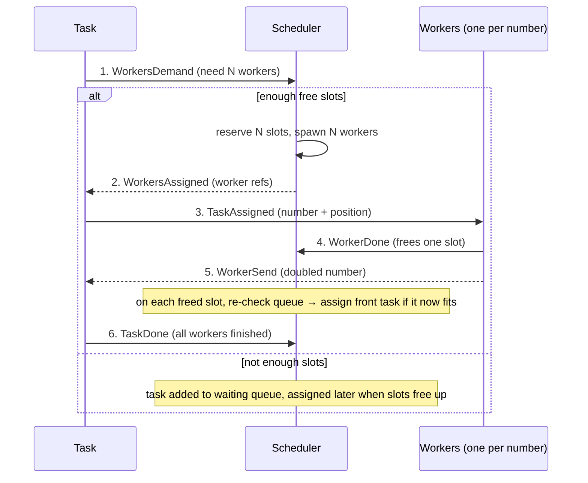

# Akka Scheduler (Java)

A small actor-based **task scheduler** with a fixed pool of worker slots and a waiting queue, built with **Akka Typed** (`akka-actor-typed`) in Java. Tasks request workers, the scheduler hands them out while capacity allows and queues the rest, and frees-up capacity automatically pulls queued tasks back in. The project demonstrates message-driven concurrency, typed actors, resource limiting, and queueing — all without shared mutable state across actors.

This was a project for the lecture *Electronic Business Processes* at TU Dortmund.

## What it does

The system spawns 10 tasks. Each task holds a list of random numbers and needs **one worker per number** to process it (a worker simply doubles its number). The catch: the scheduler only has **10 worker slots** in total, so not every task can run at once.

The lifecycle of a single task looks like this:

1. A **Task** is created with a random list of numbers and asks the **Scheduler** for as many workers as it has numbers (`WorkersDemand`).
2. If enough slots are free, the scheduler reserves them, spawns that many **Workers**, and assigns them to the task (`WorkersAssigned`). Otherwise the task goes into a **waiting queue**.
3. The task gives each worker one number and its position (`TaskAssigned`).
4. Each worker doubles its number, reports completion to the scheduler (`WorkerDone`, which frees one slot), sends the result back to the task (`WorkerSend`), and then stops.
5. The task writes each result back into its list. Once all its workers are done, it tells the scheduler it's finished (`TaskDone`) and stops.

Every time a worker frees a slot, the scheduler re-checks the queue: if the task at the front now fits in the available slots, it's pulled out of the queue and assigned workers. This is the core idea — limited capacity, fair queueing, and automatic backfilling, coordinated purely through messages.

## Message flow

The diagram below shows one task going through the scheduler, including the case where capacity is full and the task has to wait. No actor calls another directly — every arrow is an asynchronous message, and the scheduler is the only component that tracks free slots and the queue.



## Architecture

```
   Task ──WorkersDemand──► Scheduler ──spawns──► Worker(s)
     ▲                      │   ▲                   │
     │                      │   └──WorkerDone───────┤  (frees a slot,
     │                      │      (re-check queue) │   re-checks queue)
     └──WorkersAssigned─────┘                       │
     ▲                                              │
     └──────────────WorkerSend──────────────────────┘
              (doubled number written back to the task)
```

| Actor | Responsibility |
|-------|----------------|
| `Main` | Root actor; spawns the scheduler and 10 tasks, each with a random worker demand. |
| `Scheduler` | Owns the 10 worker slots and the waiting queue. Assigns workers when capacity allows, queues tasks otherwise, and backfills from the queue as slots free up. |
| `Task` | Holds a list of random numbers, requests one worker per number, distributes work, collects results, and reports completion. |
| `Worker` | Processes a single number (doubles it), reports back to both the scheduler and its task, then stops. |

Each actor communicates only through typed, immutable messages — the concurrent components stay isolated and coordinate purely by message passing.

## Tech stack

- **Java 17**
- **Akka Typed** `akka-actor-typed` 2.6.19
- **Logback** for logging
- **Gradle** (primary) — a `build.sbt` is also included as an alternative

## Running it

With the Gradle wrapper:

```bash
./gradlew run
```

The main class is `AkkaSchedulerStart`. The actors then run on their own; press **ENTER** in the console to shut the system down. The log output shows tasks requesting workers, slots being reserved and freed, the queue contents, and each task's old vs. new number list once it completes.

## Project structure

```
src/main/java/com/example/
├── AkkaSchedulerStart.java   # entry point: boots the ActorSystem
├── Main.java                 # root actor, spawns scheduler + 10 tasks
├── Scheduler.java            # slot management + waiting queue
├── Task.java                 # holds numbers, coordinates its workers
└── Worker.java               # processes one number, then stops
```

## Notes

This is a learning project focused on the actor model, resource limiting, and queueing rather than on production concerns. Some design choices (fixed task and slot counts, in-console run, doubling as the "work") reflect that scope.

## Authors

Sewerin Kuss · Duc Anh Le · Janis Melon
